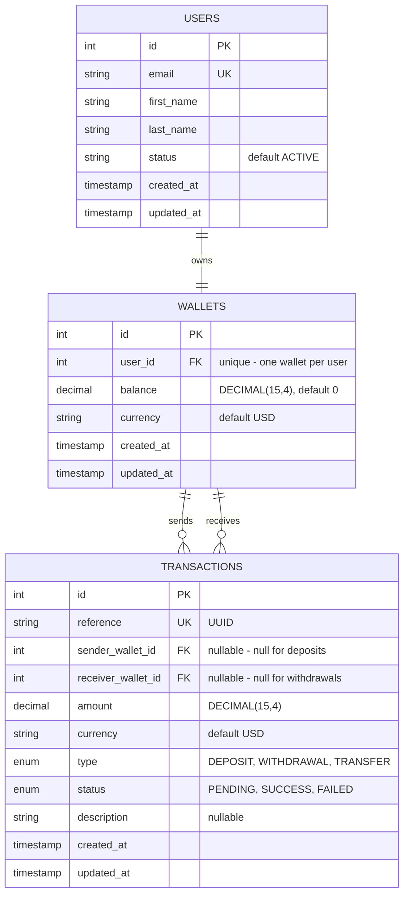

# Demo Credit — Wallet Service (MVP)

A minimum viable wallet service for **Demo Credit**, a mobile lending platform. Borrowers need a wallet to receive loan disbursements and make repayments. This API lets a user create an account, fund their wallet, transfer funds to another user, and withdraw funds — while ensuring that anyone on the **Lendsqr Adjutor Karma blacklist** is never onboarded.

> Built as part of the Lendsqr backend engineering assessment.

---

## Table of Contents
- [Features](#features)
- [Tech Stack](#tech-stack)
- [Architecture](#architecture)
- [Project Structure](#project-structure)
- [Database Design](#database-design)
- [E-R Diagram](#e-r-diagram)
- [Transaction Scoping & Concurrency](#transaction-scoping--concurrency)
- [Authentication](#authentication)
- [Karma Blacklist Integration](#karma-blacklist-integration)
- [API Reference](#api-reference)
- [Getting Started](#getting-started)
- [Testing](#testing)
- [Design Decisions & Assumptions](#design-decisions--assumptions)
- [Deployment](#deployment)
- [Author](#author)

---

## Features
- **Create an account** — onboards a user and provisions a wallet in a single atomic operation.
- **Fund wallet** — deposit money into a wallet.
- **Transfer funds** — move money from one user's wallet to another's.
- **Withdraw funds** — withdraw money from a wallet.
- **Karma blacklist enforcement** — users found on the Lendsqr Adjutor Karma blacklist cannot be onboarded.
- **Faux token authentication** — wallet operations are protected by a signed JWT.

---

## Tech Stack
| Concern | Choice |
|--------|--------|
| Runtime | Node.js (LTS) |
| Language | TypeScript (strict mode, ESM) |
| Web framework | Express 5 |
| Query builder / ORM | Knex.js |
| Database | MySQL 8 |
| Auth | JSON Web Tokens (`jsonwebtoken`) |
| HTTP client | axios (Adjutor Karma calls) |
| Testing | Vitest |
| Dev runtime | tsx |

---

## Architecture

The service follows a **layered architecture** with a clear separation of concerns. A request flows in one direction and each layer has a single responsibility:

```
HTTP Request
   │
   ▼
Routes ───► Controllers ───► Services ───► Repositories ───► MySQL
                 │               │
            (validation)   (business rules,
                            transaction scoping)
```

- **Routes** — declare endpoints and attach middleware (e.g. authentication).
- **Controllers** — parse/validate input, call a service, shape the HTTP response. No business logic.
- **Services** — own the business rules and **transaction boundaries** (Karma checks, balance checks, atomic money movement).
- **Repositories** — the only layer that talks to the database. Each repository owns one table.
- **Middleware** — cross-cutting concerns: authentication and centralized error handling.
- **Utils** — reusable helpers (`AppError`, `asyncHandler`, JWT token helpers).

This separation keeps the code DRY, makes each unit independently testable (services are tested by mocking their repositories), and isolates the database behind a thin, swappable layer.

---

## Project Structure
```
src/
├── app.ts                       # App bootstrap, middleware & route mounting
├── config/
│   ├── database.ts              # Knex instance (single connection pool)
│   ├── knexConfig.js            # Single source of truth for Knex config
│   └── migrations/              # Database schema migrations
├── controllers/                 # Request/response handlers
│   ├── userController.ts
│   └── walletController.ts
├── services/                    # Business logic & transaction scoping
│   ├── userService.ts
│   ├── walletService.ts
│   └── karmaService.ts
├── repositories/                # Data access layer (one per table)
│   ├── userRepository.ts
│   ├── walletRepository.ts
│   └── transactionRepository.ts
├── middleware/
│   ├── auth.ts                  # Faux JWT authentication
│   └── errorHandler.ts          # Centralized error responses
├── routes/
│   ├── userRoutes.ts
│   └── walletRoutes.ts
├── utils/
│   ├── AppError.ts              # Custom operational error class (OOP)
│   ├── asyncHandler.ts          # Async error-forwarding wrapper
│   └── token.ts                 # JWT sign/verify helpers
└── types/
    ├── express.d.ts             # Augments Express Request with `user`
    └── models.ts                # Domain model interfaces
```

---

## Database Design

Three tables model the domain:

### `users`
| Column | Type | Notes |
|--------|------|-------|
| id | INT (PK, auto-increment) | |
| email | VARCHAR, unique, not null | login/identity |
| first_name | VARCHAR, not null | |
| last_name | VARCHAR, not null | |
| status | VARCHAR, not null, default `ACTIVE` | supports soft state changes |
| created_at / updated_at | TIMESTAMP | |

### `wallets`
| Column | Type | Notes |
|--------|------|-------|
| id | INT (PK, auto-increment) | |
| user_id | INT, unique, not null, FK → users.id | one wallet per user; `ON DELETE RESTRICT` |
| balance | DECIMAL(15,4), not null, default 0 | fixed-precision money |
| currency | VARCHAR, not null, default `USD` | |
| created_at / updated_at | TIMESTAMP | |

### `transactions` (ledger)
| Column | Type | Notes |
|--------|------|-------|
| id | INT (PK, auto-increment) | |
| reference | VARCHAR, unique, not null | UUID per transaction |
| sender_wallet_id | INT, **nullable**, FK → wallets.id | NULL for deposits |
| receiver_wallet_id | INT, **nullable**, FK → wallets.id | NULL for withdrawals |
| amount | DECIMAL(15,4), not null | |
| currency | VARCHAR, not null, default `USD` | |
| type | ENUM(`DEPOSIT`,`WITHDRAWAL`,`TRANSFER`) | |
| status | ENUM(`PENDING`,`SUCCESS`,`FAILED`), default `PENDING` | |
| description | VARCHAR, nullable | |
| created_at / updated_at | TIMESTAMP | |

**Design rationale:**
- **`DECIMAL(15,4)` for money** — fixed-precision avoids floating-point rounding errors that are unacceptable in financial systems.
- **Single ledger table with nullable sender/receiver** — one table cleanly models all three movement types (a deposit has no internal sender; a withdrawal has no internal receiver; a transfer has both). This keeps the schema DRY and a single `transactionRepository.create()` handles every case.
- **`ON DELETE RESTRICT`** on foreign keys — financial records must never be silently destroyed; deleting a user/wallet with history is rejected for compliance and auditability.
- **Unique `reference` (UUID)** — gives every movement a globally unique, traceable identifier, and serves as the foundation for de-duplication/idempotency (a retried operation reusing a reference would violate the unique constraint rather than double-process).

---

## E-R Diagram



---

## Transaction Scoping & Concurrency

Money operations are the most safety-critical part of the system, so each one runs inside a **database transaction** with appropriate locking:

- **Fund** — a pure atomic SQL increment (`balance = balance + ?`); no lock needed because the operation does not read-then-write.
- **Withdraw** — locks the wallet row with `SELECT ... FOR UPDATE` inside the transaction, then checks the balance and decrements. The lock prevents two concurrent withdrawals from both reading a stale balance and overdrawing the account.
- **Transfer** — locks **both** wallets with `FOR UPDATE`, ordered deterministically **by wallet id**, to prevent deadlocks when two users transfer to each other at the same time. The balance check and both balance mutations happen within the same locked transaction, so they cannot be interleaved by another request.

All balance mutations use Knex `.increment()` / `.decrement()`, which translate to atomic SQL arithmetic — sidestepping JavaScript floating-point issues entirely. If any step fails, the entire transaction rolls back, so a wallet can never be debited without the corresponding credit and ledger record being written.

---

## Authentication

Per the assessment, this uses **faux token-based authentication** rather than a full login system:
- On account creation, the API issues a **signed JWT** containing the user's id (`{ userId }`), valid for 1 day.
- Wallet endpoints require an `Authorization: Bearer <token>` header. The `authenticate` middleware verifies the token and attaches `req.user`.
- A signed JWT (rather than a raw user id) is used so the caller's identity cannot be forged without the server secret — secure enough to be meaningful, without building password/session management that is out of scope for the MVP.

---

## Karma Blacklist Integration

Before onboarding, the service queries the **Lendsqr Adjutor Karma** endpoint:
```
GET https://adjutor.lendsqr.com/v2/verification/karma/{identity}
Authorization: Bearer <ADJUTOR_API_KEY>
```
- A **match** (a record containing `karma_identity`) → the user is blacklisted → onboarding is rejected with `403`.
- A **`404`** (or empty response) → the identity is clean → onboarding proceeds.

**Test mode note:** This integration was built against Adjutor **test mode**, because live mode requires approved KYC, which is not available to an assessment account using placeholder documents. Test mode exercises the exact same endpoint and authentication but returns empty dummy data (it does not query the real blacklist). The blacklist-rejection logic is therefore verified via **unit tests that mock a positive Karma response**, while the live integration uses the real endpoint, URL, and auth.

---

## API Reference

Base URL (local): `http://localhost:3000`

All responses follow the shape `{ "status": "success" | "error", ... }`. Errors return `{ "status": "error", "message": "..." }`.

### Health
```
GET /health
```

### Create account
```
POST /api/users
Content-Type: application/json

{ "email": "jane@example.com", "firstName": "Jane", "lastName": "Doe" }
```
**201 Created**
```json
{
  "status": "success",
  "data": {
    "user": { "id": 1, "email": "jane@example.com", "firstName": "Jane", "lastName": "Doe" },
    "token": "<jwt>"
  }
}
```
Errors: `409` email exists · `403` blacklisted · `400` missing fields.

### Get balance
```
GET /api/wallet/balance
Authorization: Bearer <token>
```
**200 OK** → `{ "status": "success", "data": { ...wallet } }`

### Fund wallet
```
POST /api/wallet/fund
Authorization: Bearer <token>

{ "amount": 500 }
```
**200 OK** → updated wallet. Errors: `400` invalid amount.

### Withdraw
```
POST /api/wallet/withdraw
Authorization: Bearer <token>

{ "amount": 200 }
```
**200 OK** → updated wallet. Errors: `400` insufficient funds / invalid amount.

### Transfer
```
POST /api/wallet/transfer
Authorization: Bearer <token>

{ "recipientEmail": "john@example.com", "amount": 100 }
```
**200 OK** → sender's updated wallet. Errors: `400` self-transfer / insufficient funds · `404` recipient not found.

---

## Getting Started

### Prerequisites
- Node.js (LTS) and npm
- MySQL 8 (a `docker-compose.yml` is provided for local MySQL)
- A Lendsqr Adjutor API key

### 1. Clone & install
```bash
git clone https://github.com/XulunH/lendsqr-project
npm install
```

### 2. Configure environment
Copy `.env.example` to `.env` and fill in the values:
```bash
cp .env.example .env
```
```
PORT=3000
NODE_ENV=development
DB_HOST=127.0.0.1
DB_PORT=3306
DB_USER=wallet_user
DB_PASSWORD=your_password
DB_NAME=lendsqr_wallet
JWT_SECRET=your_long_random_secret
ADJUTOR_API_KEY=your_adjutor_key
```

### 3. Start MySQL (optional, via Docker)
```bash
docker compose up -d
```

### 4. Run migrations
```bash
npm run migrate
```

### 5. Run the app
```bash
npm run dev      # development (hot reload)
# or
npm run build && npm start   # production
```

---

## Testing

Unit tests are written with **Vitest** and cover positive and negative scenarios across the token utility, Karma service, user onboarding, and all wallet operations (including insufficient funds, self-transfer, and blacklist rejection). External dependencies (database, Adjutor API) are mocked, so the suite is fast and deterministic.

```bash
npm test
```

---

## Design Decisions & Assumptions
- **Layered architecture (routes → controllers → services → repositories)** for separation of concerns, testability, and DRY code.
- **Faux JWT auth** instead of full authentication, as permitted by the assessment.
- **Passwords omitted** from the user model — they add no value to a faux-auth MVP and would only introduce unused complexity.
- **`DECIMAL(15,4)` + SQL-level arithmetic** for exact, atomic money math.
- **Row locking + deterministic lock ordering** for safe, deadlock-free concurrent money movement.
- **Centralized error handling** via a custom `AppError` class and a single error middleware, so controllers stay thin and error responses are consistent.
- **Unique UUID transaction reference** for traceability and as a foundation for idempotent retries.
- **Karma built against test mode** due to KYC constraints (see above).
- **Single shared Knex config** consumed by both the app and the migration CLI to avoid duplication.

---

## Deployment

The API is deployed at:

**https://jasonhuang-lendsqr-be-test.onrender.com**

---

## Author

**Jason Huang**